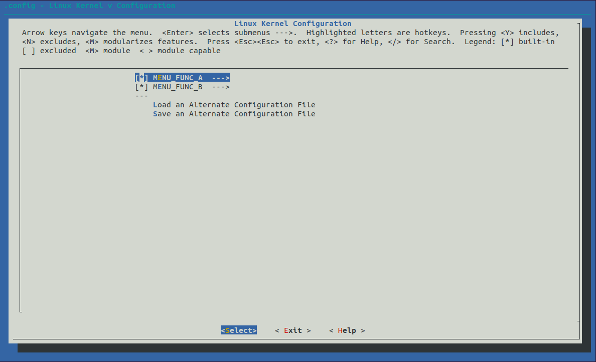

# mconf 工具使用

## 目录

Kconfig 配置文件层级关系。

```
paul@vmware:~/soc/kbuild-study/6.kconfig/1.manual$ tree
.
├── a
│   ├── a1
│   │   └── Kconfig
│   └── Kconfig
├── b
│   └── Kconfig
├── image
│   └── mconfig.png
├── Kconfig
├── README.md
└── scripts
    └── kconfig
        └── mconf

6 directories, 7 files
paul@vmware:~/soc/kbuild-study/6.kconfig/1.manual$ 
```

## 用法

手动调用 mconf 工具解析 Kconfig 文件。将会弹出配置菜单界面。

```
./scripts/kconfig/mconf Kconfig
```

配置界面截图如下：



配置结束，配置结果保存在在 `.config` 文件中。

```
paul@vmware:~/soc/kbuild-study/6.kconfig/1.manual$ ./scripts/kconfig/mconf Kconfig 
#
# configuration written to .config
#


*** End of Linux kernel configuration.
*** Execute 'make' to build the kernel or try 'make help'.

paul@vmware:~/soc/kbuild-study/6.kconfig/1.manual$ cat .config 
#
# Automatically generated make config: don't edit
# Linux kernel version: 
# Thu Jun 17 04:07:48 2021
#
CONFIG_MENU_FUNC_A=y
CONFIG_FUNC_A=y
CONFIG_FUNC_A1=y
CONFIG_MENU_FUNC_B=y
CONFIG_FUNC_B=y
paul@vmware:~/soc/kbuild-study/6.kconfig/1.manual$ 
```

